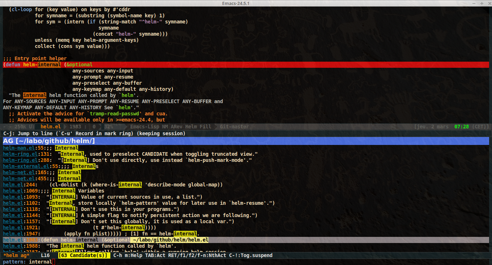
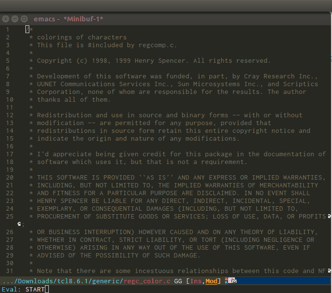

<p><a href="http://www.gnu.org/licenses/gpl-3.0.txt"></a>
  <a href="https://melpa.org/#/helm"></a>
  <a href="https://stable.melpa.org/#/helm"></a></p>

<h1>Emacs-helm</h1>

<p></p>


<p>
Maintainance of Helm is a <a href="https://github.com/emacs-helm/helm/commits?author=thierryvolpiatto"><b>Lot of work</b></a>
I have done freely since 2011.<br>
As it is taking a lot of my time it starts to be more and more difficult<br>
maintaining it without financial help.<br> 
If you feel Helm is making your daily work easier,<br><b>please consider making a donation.</b>
</p>

<p>
<i>Thank you! &mdash; Thierry Volpiatto</i>
</p>

<a href="https://www.paypal.com/cgi-bin/webscr?cmd=_donations&amp;business=thierry.volpiatto@gmail.com&amp;lc=US&amp;currency_code=EUR&amp;bn=PP-DonationsBF:btn_donateCC_LG.gif:NonHosted"></a>

<a href="https://patreon.com/preview/30231724baf440fabe80d44d0ee77067">
  </a>


[](https://gratipay.com/emacs-helm/)


<!-- markdown-toc start - Don't edit this section. Run M-x markdown-toc-generate-toc again -->
**Table of Contents**

- [Introduction](#introduction)
- [Requirements](#requirements)
- [Getting Started](#getting-started)
    - [Quick install from git](#quick-install-from-git)
    - [Install from Emacs packaging system](#install-from-emacs-packaging-system)
    - [Debian and Ubuntu](#debian-and-ubuntu)
    - [Installing just the helm-core package](#installing-just-the-helm-core-package)
    - [Warning about alternate installation methods](#warning-about-alternate-installation-methods)
    - [Configuration](#configuration)
    - [Basic usage](#basic-usage)
    - [Advanced usage](#advanced-usage)
        - [Matching methods](#matching-methods)
        - [Creating custom helm sources](#creating-custom-helm-sources)
- [Helm Applications](#helm-applications)
- [Recommended Helm extensions](#recommended-helm-extensions)
- [Known issues](#known-issues)
- [Contributors](#contributors)
- [Bugs & Improvements](#bugs--improvements)
- [Getting help](#getting-help)

<!-- markdown-toc end -->

# Introduction

`Helm` is an Emacs framework for incremental completions and narrowing
selections. It helps to rapidly complete file names, buffer names, or
any other Emacs interactions requiring selecting an item from a list of
possible choices.

Helm is a fork of `anything.el`, which was originally written by Tamas
Patrovic and can be considered to be its successor. `Helm` cleans the
legacy code that is leaner, modular, and unchained from constraints of
backward compatibility.



# Requirements

Helm requires Emacs-24.4 or later versions.

Helm installs [async](https://github.com/jwiegley/emacs-async) package as a dependency
when Helm is installed using [MELPA](https://melpa.org/). 

Helm installation from the git source repository does not include
async. The async package is recommended for smooth asynchronous file
and dired operations in Helm.

# Getting Started

## Quick install from git

  1. Clone the `helm` repository to some directory:
  
    ```elisp
    $ git clone https://github.com/emacs-helm/helm.git /path/to/helm/directory
    ```

  2. Clone the `async` repository to some directory (facultative)

    ```elisp
    $ git clone https://github.com/jwiegley/emacs-async.git /path/to/async/directory
    ```
  3. Run `make` from the `helm` directory.
  
  3. Add to `.emacs.el` (or equivalent):

    ```elisp
    ;; If async is installed
    (add-to-list 'load-path "/path/to/async/directory")
    
    (add-to-list 'load-path "/path/to/helm/directory")
    (require 'helm-config)
    ```
    
_NOTE:_ Installing helm using git and make is the safest way.

To quickly run `helm`, launch this script from helm directory:

`./emacs-helm.sh`

Also use the same script above for bug reporting.

_NOTE:_ This script does not work on Windows systems.

## Install from Emacs packaging system

Helm can also be installed from MELPA repository at https://melpa.org/.
You will find the instructions to install packages from MELPA [here](https://github.com/melpa/melpa#usage).

No further configuration is necessary to run helm other than perhaps a
one-line entry in the Emacs init file:

```elisp
(require 'helm-config)
```

_WARNING:_ Helm upgrades from MELPA repository encountered errors
because of the way package.el fetched and compiled updates for
existing packages. To get around these errors, Helm adds
[Async](https://github.com/jwiegley/emacs-async) as a dependency
package install. Async forces compilation in a clean environment,
which solves those compilation errors. Since async has other benefits
as well, both for Helm and other packages, we recommend installing
async even for Helm installs using git. See
[FAQ](https://github.com/emacs-helm/helm/wiki#faq) for details.

_Note:_ Restart Emacs for Helm updates from MELPA repositories to take
effect.

**Note to Linux Distributions Maintainers**

`Only the extensions in the github emacs-helm repository are supported.`

## Debian and Ubuntu

Users of Debian 9 or later or Ubuntu 16.04 or later may simply
`apt-get install elpa-helm` (or `apt-get install elpa-helm-core`; see
below).

## Installing just the helm-core package

`helm-core` package is available on [MELPA](https://melpa.org/) for
third party packages that depend on helm libraries. These packages
should require helm as follows:

     (require 'helm)

Requiring helm builds and runs helm code necessary for multiple regexp
and fuzzy matching. See
[helm wiki](https://github.com/emacs-helm/helm/wiki#developpingusinghelmframework)
for details.

## Warning about alternate installation methods
    
Installation methods that circumvent `helm-config` are known to fail
if the careful safeguards are not implemented in the hacks. 

## Configuration

For minimal helm configuration, run the start-up script `./emacs-helm.sh`
and then see the file `/tmp/helm-cfg.el`.

The full configuration I (the helm maintainer) use is
[here](https://github.com/thierryvolpiatto/emacs-tv-config/blob/master/init-helm-thierry.el).

Also see helm customizable variables with the customize interface.

Enabling `helm-mode` will enable helm for many features of emacs
requiring completions, see below how to enable `helm-mode`.

## Basic usage

`M-x helm-M-x RET helm-` lists helm commands ready for narrowing and selecting.

To bind to `M-x`: 

`(global-set-key (kbd "M-x") 'helm-M-x)`

- _IMPORTANT:_

In any helm session (after `helm-M-x` or `helm-` command)

`C-h m` pops a general info buffer about helm

`C-c ?` pops a special info buffer of the current helm command

Not all helm commands have specialized info buffers. Look for `C-c ?`
in the mode-line. `C-h m` is shown for any command that does not have
a specialized info buffer.

Use these embedded Info screens first before reporting bugs.

`M-x helm-mode` to enable helm completion for common Emacs
commands. Note that the helm functionality enabled through helm-mode
comes from a generic implementation and does not include all helm
features available through equivalent helm-specific commands.
See [FAQ](https://github.com/emacs-helm/helm/wiki/FAQ#why-after-enabling-helm-mode-m-x-and-c-x-c-f-are-not-helmized)
about `M-x` and `C-x C-f`.

To make helm-mode start with Emacs init file: 

```elisp
(helm-mode 1)
```

To discover helm commands, look at helm menu item in Emacs menu. 

Another way to discover helm commands: run the shell script:
`./emacs-helm.sh` and then look in the scratch buffer. `emacs-helm.sh`
accepts emacs command line options. `emacs-helm.sh -h` opens an Info
screen with more details.

## Advanced usage

Helm contains many features, some of which are easier to follow
visually. Here is a demo of `helm-buffers-list` used with
`helm-moccur`. Demo starts with `Eval: START` in the minibuffer.



- Regexp `*C` selects the C buffers. `*Tcl` in the demo selects TCL
  buffers, then with `*C` switches back to C buffers.
- For buffers containing the string "crash", the demo adds a space,
  then the pattern `@crash`.
- Matching buffers are then handed over to `helm-moccur` - `moccur`
  with its own Helm interface. The demo shows switching to a
  single file, `kexec.c`. Multiple selections can be made with
  `C-SPC`. `M-a` selects all.
- Adding characters to the pattern gradually filters (narrows) the
  available candidates. By adding `memory`, the buffers shown now
  include those buffers with "crash" and "memory".

With more pattern matching, candidates are narrowed down from the
initial 253 buffers to 12 as shown in the modeline. 

Helm [guide](http://tuhdo.github.io/helm-intro.html) and
[Helm Wiki](https://github.com/emacs-helm/helm/wiki) provide
additional details.

### Matching methods

Helm support by default multi pattern matching, it is the standard way
of matching in helm.
E.g You can use a pattern like "foo bar" to match a line containing "foo" and "bar"
or "bar" and "foo".
Each pattern can be a regexp.

In addition helm support [fuzzy matching](https://github.com/emacs-helm/helm/wiki/Fuzzy-matching).

### Creating custom helm sources

An example:

```elisp

(helm :sources (helm-build-sync-source "test"
                 :candidates '(foo foa fob bar baz)
                 :fuzzy-match t)
      :buffer "*helm test*")
```

The candidates list may be replaced by a function that produces a list.
See ([helm wiki](https://github.com/emacs-helm/helm/wiki#25-developing-using-helm-framework))
for details.

# Helm Applications 

These are popular applications developed using helm completion and
narrowing framework. They are available for individual installs
through the Emacs package manager. This list is not exhaustive.

- `helm-mode`: turns on helm completions for most standard emacs
  completions. Helm provides even more optimized helm completions for
  some commands in helm-mode. Prefer these natively optimized versions
  over the ones in helm-mode.
  
- `helm-find-files`: one command that handles all the files related
  commands (bind to `C-x C-f`).
  
- `helm-buffers-list`: provides enhanced buffers listing.

- `helm-browse-project`: handles project files and buffers; defaults
   to current directory; works with `helm-find-files`; recommended
   with [helm-ls-git](https://github.com/emacs-helm/helm-ls-git),
   [helm-ls-hg](https://github.com/emacs-helm/helm-ls-hg) and
   `helm-ls-svn` for a better handling of version control files.
   Each time a project under version control is visited it is added
   to `helm-browse-project-history` and can be visted with `helm-projects-history`.
   
- `helm-dabbrev`: enhanced dabbrev implementation with helm
  completion; does not use emacs code.
  
- `helm-moccur`: enhanced occur for one or more buffers; launch from
  `helm-buffers-list` or `current-buffer`.
  
- `helm-M-x`: enhanced `execute-extended-command` (bind it to `M-x`).

- `helm-imenu` and `helm-imenu-in-all-buffers`: provide imenus for
  current or all buffers.
  
- `helm-etags-select`: enhanced etags with helm-completion; usable
  everywhere with `helm-find-files`.
  
- `helm-apropos`: enhanced apropos for functions and variables that
  `C-h` commands provide.
  
- `Grep`: launch from any helm file commands; supports back-ends
  `grep`, `ack-grep`, `git-grep`, `ag` and custom implementation of
  `pt`.
  
- `helm-gid`: Helm interface for `gid` from
  [id-utils](https://www.gnu.org/software/idutils/).
  
- `helm-show-kill-ring`: A helm browser for kill ring.

- `helm-all-mark-rings`: A helm browser for mark ring; retrieves last positions in buffers.

- `helm-filtered-bookmarks`: enhanced browser for bookmarks.

- `helm-list-elisp-packages`: enhanced browser for elisp package management.

# Recommended Helm extensions

- [helm-ls-git](https://github.com/emacs-helm/helm-ls-git)
- [helm-ls-hg](https://github.com/emacs-helm/helm-ls-hg)
- [helm-descbinds](https://github.com/emacs-helm/helm-descbinds)
- [helm-firefox](https://github.com/emacs-helm/helm-firefox)

**Warning** Helm development has sparked quite a few extensions, many
of which duplicate features already included in helm. Some of these
packages (about 20 at last count in the MELPA repository) are either
deprecated or unmaintained. Moreover, many remain out-of-sync with
`helm` core development cycles causing incompatibilities. To avoid
helm problems or unstable emacs, please look for comparable features
within [helm](https://github.com/emacs-helm/helm) and
[emacs-helm](https://github.com/emacs-helm) before installing such
extensions.

# Known issues

The Helm project has a current unresolved 
[issue list](https://github.com/emacs-helm/helm/issues?sort=created&direction=desc&state=open).
Please feel free to fix any of them; send a pull request.

# Contributors

The Helm project maintains a
[list](https://github.com/emacs-helm/helm/contributors) of
contributors.

# Bugs & Improvements

The Helm Team welcomes bug reports and suggestions. Note that not all
bugs when using Helm are due to Helm. Because of the way Helm
interacts with many Emacs features, bugs may be related to Emacs
itself.

One way to ascertain that the bugs are helm-related, recreate the
error either by using `Emacs -Q` or by running the included package
script `./emacs-helm.sh` located in the helm directory.

Helm comes now with a template for filling bugs, when reporting issues,
be sure to fill all sections and to run helm from a minimal install as
described above to reproduce your bug.
 
# Getting help

[Helm Wiki](https://github.com/emacs-helm/helm/wiki) and
[emacs-helm Google group](https://groups.google.com/group/emacs-helm?hl=en)
are two readily available locations.

Cheers,<br>
The Helm Team

[badge-license]: https://img.shields.io/badge/license-GPL_3-green.svg
